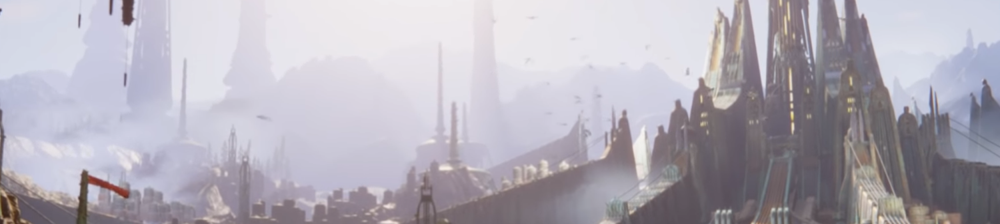
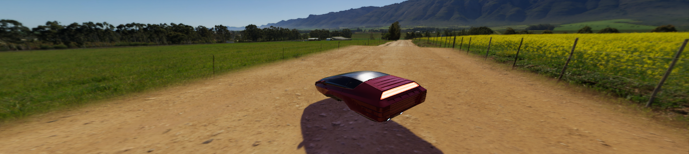

Unity 高清渲染管线 (HDRP)

[TOC]

# Features

## 项目

### 平台支持

Xbox One、PlayStation 4 以及与 Compute Shader 兼容的设备（适用于 DirectX 11、DirectX 12、Metal 和 Vulkan）

### VR

HDRP 与 VR 兼容，并针对 Single Pass Rendering 进行了优化

### Camera-relative Rendering

与内置渲染管线相比，HDRP 以更稳健和数值更稳定的方式渲染远处的游戏对象（具有较大的世界空间坐标）。

### Dynamic resolution

使用动态分辨率时，HDRP 能够以不同的分辨率进行渲染。为此，HDRP 要么使用硬件功能（如果可用），要么渲染到大小等于或小于当前视口的渲染目标。这有助于在 Unity 项目中保持稳定的帧率。

### Volume

使用 Volume 可以本地化环境场景设置和后期处理效果。可以在一个场景中拥有多个 Volume ，并根据摄像机的位置来创建诸如 Fog Density、天空颜色或曝光等效果。

## 材质（Material）

HDRP Shader 允许使用以下功能：

- 不透明/半透明表面（Opaque/Transparent surfaces）。
  - 半透明表面的不同混合模式。
  - 与雾效搭配使用的半透明表面。
  - 透明表面的折射和扭曲。
- 材质类型（Material types）。
  - 各向异性（Anisotropy），适用于从不同角度查看时会改变高光的表面，例如拉丝金属或天鹅绒。
  - 彩虹色（Iridescence），适用于从不同角度查看时会改变颜色的表面，例如肥皂泡或昆虫翅膀。
  - 金属性（Metallic），适用于仅由镜面反射光照提供光照并为镜面反射颜色采用基础颜色输入的表面。例如，铝、铜和钢。
  - 镜面反射颜色（Specular Color），适用于需要具有彩色镜面反射高光的表面。
  - 次表面散射（Subsurface Scattering），适用于模拟光线相互作用和散射的半透明表面，例如皮肤或植物叶子。
  - 半透明（Translucent），适用于模拟光线相互作用但不会模糊穿透材质的光线的表面。
- 像素和顶点位移（Pixel & Vertex displacement），适用于要基于高度图进行位移的表面。
- 自发光（Emission），适用于要用作自发光光源的材质。
- 贴花（Decals），适用于要将纹理投射到的表面。
- 细节贴图（Detail mapping），适用于要将微小细节添加到的表面。

### Lit Shader

Lit Shader 可用于轻松创建逼真的材质，并包含用于诸如次表面散射、彩虹色和半透明等效果的选项。这是 HDRP 中的默认着色器。

### Layered Lit Shader

Layered Lit Shader 将主要材质与其他可平铺的材质组合在一起，以便产生质量与单个高分辨率纹理相似的视觉效果，但其性能损耗低于使用单个高分辨率纹理的光照着色器。

### Unlit Shader

Unlit Shader 可用于不受光照影响的材质。Unlit Shader 非常适合生成视觉效果。在设置中打开 Shadow Matte 选项，能够使 Surface 在无光照的情况下产生阴影。可以有不透明和半透明阴影，每种阴影都有 Alpha 值。

### StackLit Shader

StackLit Shader 在 Lit Shader 上进行了改进，相对于性能而言，更注重质量。与 Lit Shader 相比，此 Shader 可以更精确的 Surface，而与 Lit Shader 不同的是，此 Shader 可以让你同时使用多种材质特性，例如 anisotropy、subsurface scattering iridescence 以及模糊参数 （hazy parametrization）。

### Hair Shader

Hair Shader 专为在 Unity 项目中精确渲染逼真的毛发而设计。此 Shader 使用改进的 Kajiya Kay 光照模型，该模型具有更好的性能，并提供更大的灵活性。

### Fabic Shader

Fabric Shader 允许在 HDRP 中渲染逼真的织物材质。您可以使用棉绒或丝绸光照模型来创建各种各样的织物。

### AxF Shader

AxF Shader 支持 X-Rite AxF 可测量的材质格式。Unity Enterprise for Product Lifecylce 中提供的 AxF Importer 在导入 AxF 资源时自动填充 AxF 材质。

### Decal Shader

Decal Shader 可用于在场景中的表面上放置贴花。要将贴花应用到某个表面上，可以使用 Decal Projector 组件将贴花投影到该表面上，也可以将贴花直接设置给网格，然后将网格放置在表面上。

### Terrain Shader

Terrain Shader 与内置的地形系统兼容，并且在单个 draw call 中最多支持八层。此 Shader 使用与 Lit Shader 相同的光照模型。

## 光照（Lighting）

HDRP 光源类型使用物理光单位（Physical Light Units ， PLU）来帮助您以最逼真的方式为场景提供光照。为使光源在使用 PLU 时正常工作，需要遵循 HDRP 单位约定（1 个 Unity 单位等于 1 米）。HDRP 光源类型为：

- **方向光（Directional）**
  - 色温（Color temperature）
  - 彩色剪影（Colored cookie）
  - 阴影遮罩（Shadowmask）支持
- **聚光灯（Spot）**
  - 色温（Color temperature）
  - 彩色剪影（Colored cookie）
  - 阴影遮罩（Shadowmask）支持
  - 圆锥、棱锥和盒体形状（Cone，Pyramid and Box）
- **点光源（Point）**
  - 色温（Color temperature）
  - 彩色剪影（Colored cookie）
  - 阴影遮罩（Shadowmask）支持
- **矩形光源（Rectangle）**
  - 色温（Color temperature）
  - 彩色剪影（Colored cookie）
  - 阴影遮罩（Shadowmask）支持
- **灯管（Tube）**
  - 色温
  - 无阴影遮罩（No Shadowmask）支持
- **圆盘光源（仅烘焙）（Disk，Baked only）**
  - 色温
  - 无阴影遮罩（No Shadowmask）支持

### 反射探针（Reflection Probes）

HDRP 支持立方体贴图和平面 GPU 反射探针，可帮助您在场景中实时产生逼真的反射。

### 屏幕空间反射和折射（Screen-space reflection and refraction）

HDRP 提供了用于反射和折射的屏幕空间解决方案。它使用屏幕的深度和颜色缓冲区来帮助模拟光线传播到摄像机的路径，从而计算出准确的反射和折射。

### 屏幕空间扭曲（Screen-space distortion）

HDRP 提供了用于扭曲的屏幕空间解决方案。扭曲与折射相似，只是它是纯粹由美术控制的。

### 自发光（Emission）

HDRP 材质支持自发光，这使您可以将材质制成自发光的可见光源。全局光照会考虑自发光，可以根据实际光源使用物理光单位（PLU）来设置强度。

### 阴影（Shadows）

HDRP 使用多种方法来计算阴影：

- 阴影级联（Shadow cascades）：HDRP 使用级联分割来根据与摄像机的距离控制方向光投射的阴影质量。
- 接触阴影（Contact Shadows）：HDRP 光线追踪到深度缓冲区内以处理这些阴影。这样，HDRP 可以捕获常规阴影算法无法捕获的一些小细节。
- 微阴影：HDRP 使用材质的法线贴图和环境光遮蔽贴图来估算这些贴图（如果它们是网格）将投射的阴影。

要减少主级联阴影贴图的锯齿，可以对它们应用不同的过滤器，例如 PCF 或 PCSS。

对于精准光源和面光源阴影，HDRP 可以根据光源覆盖的屏幕大小来实现动态分辨率。HDRP 会重新缩放阴影图集的内容，否则为全屏。

在阴影贴图的高级设置中，还可以在阴影或阴影的半影上应用色调。

### 天空（Sky）

在 HDRP 中，您可以在 Volume 中设置 Sky，因此您可以更改 Sky 设置，甚至可以更改 Sky 本身的类型，具体取决于 Camera 在场景中的位置。HDRP 允许您将视觉 Sky 与用于环境光照的 Sky 分开。HDRP 包含以下内置 Sky 类型供您在 Unity 项目中使用：

- 渐变 Sky  （Gradient Sky）：使用 Sky 的顶部、中部和底部三个颜色区域渲染简单的 Sky 。
- HDRI  Sky  （HDRI Sky）：根据您在 HDRI Volume 组件中设置的立方体贴图纹理来构造天空环境。
- 基于物理的 Sky  （Physically Based Sky）：模拟具有两部分大气的球形行星，其中大气的密度会相对于高度呈指数递减。
- 程序化 Sky （Procedural Sky）：根据您在 Procedural Sky Volume 组件中选择的值来生成环境。这类似于 Unity 内置渲染管线中的程序化 Sky 。这种 Sky 类型已弃用，但仍可以在 HDRP 项目中使用。

HDRP 能够处理不同 Camera 看到的多个 Sky。

### 雾效（Fog）

在 HDRP 中，您可以在 Volume 中设置雾效，因此可以更改雾效设置，甚至可以更改雾效类型本身，具体取决于 Camera 在场景中的位置。可以自己设置雾的颜色，也可以使用 Sky 的颜色。HDRP 雾效会影响具有不透明和透明表面的材质。HDRP 实现了具有可选体积效果的指数雾。

### 光源层（Light Layers）

光源层是您为光源和网格指定的 LayerMask。光源仅照明对应光源层的上开启了光照的 Meshes。还可以在阴影贴图设置中使用光源层将阴影与光照分离。

阴影贴图下拉选单中的光源层还可用于控制哪个对象从哪个光源获得阴影。默认情况下，光源层和阴影贴图光源层都是同步的，因此结果是相互影响的（对象接收光时也会投射阴影）。

### 屏幕空间环境光遮蔽（Screen space ambient occlusion）

HDRP 包括一个屏幕空间环境光遮蔽（screen space ambient occlusion）效果，可实时模拟环境光遮蔽（ambient occlusion）。它根据场景中的光源和游戏对象周围的环境来模拟环境光在游戏对象表面上的强度和位置。

### 屏幕空间镜面反射遮挡（Screen space specular occlusion）

HDRP 还提供了对屏幕空间环境光遮蔽（Screen space ambient occlusion）效果的扩展，该扩展效果支持方向信息。HDRP 将此效果直接应用于间接镜面反射光照。

### 物理光单位（Physical light units）

HDRP 使用真实的物理光单位，因此可以轻松地以真实的方式为场景提供光照。

使用物理光单位时，光线强度可能确实很高，并且会导致精度问题和高光限制。 为了抵消这种影响，HDRP 会使用预曝光。在存储光照信息之前，预曝光会应用上一帧的摄像机曝光。

### 光线追踪（预览版）

HDRP 使用光线追踪代替其某些屏幕空间效果、阴影技术和 Mesh 渲染技术。 实时光线追踪效果目前处于预览版，将来可能会改变行为。

- 光线追踪环境光遮蔽（Ray-Traced Ambient Occlusion）取代了屏幕空间环境光遮蔽（screen space ambient occlusion），前者采用更精确的光线追踪环境光遮蔽技术，可利用屏幕外的数据。
- 光线追踪接触阴影（Ray-Traced Contact Shadows）取代了接触阴影，前者采用更精确的光线追踪接触阴影技术，可利用屏幕外的数据。
- 光线追踪全局光照（Ray-Traced Global Illumination）是 HDRP 中光照探针和光照贴图的替代方法。
- 光线追踪反射（Ray-Traced REflections）取代了屏幕空间反射（screen space reflection），前者采用光线追踪反射技术，可利用屏幕外的数据。
- 光线追踪阴影（Ray-Traced Shadows）取代了方向光、点光源和面光源等光源的阴影贴图。
- 递归光线追踪（Recursive Ray Tracing）取代了 Meshes 的渲染管线。使用该功能的 Meshes 将递归投射折射和反射光线。

## 摄像机（Camera）

### 后期处理（Post-processing）

HDRP 包含自己专用的后期处理实现方案，用于生成异常高质量的图形。可以使用后期处理将全屏滤镜和效果应用于 Camera，从而以极少的设置时间显著改善 Unity 项目的视觉效果。

### 自定义后期处理（Custom Post-processing）

HDRP 允许添加与 Volume 框架集成的自定义后期处理。可以在不透明和天空对象之后、内置后期处理之前或内置后期处理之后注入后处理。

### 抗锯齿（Anti-Aliasing）

HDRP 包含以下抗锯齿方法，可帮助您在考虑性能和质量的情况下消除锯齿效果：

- 多重采样抗锯齿（MSAA）：对每个像素中的多个位置进行采样，并将这些样本合并以生成最终像素。这是 HDRP 中最耗费资源的抗锯齿技术。
- 时间抗锯齿（TAA）：使用历史缓冲区中的帧来平滑边缘，比快速近似抗锯齿技术更有效。在运动中的边缘平滑效果方面要明显好得多，但您必须为此启用运动矢量。
- 亚像素形态抗锯齿（SMAA）：在图像的边界中查找图案，并根据该图案混合这些边界上的像素。
- 快速近似抗锯齿（FXAA）：在每个像素级别上平滑边缘。这是 HDRP 中最不耗费资源的抗锯齿技术。

### 物理摄像机（Physical Camera）

HDRP 使用基于物理的摄像机系统，该系统与 HDRP 的其他物理特性（例如物理光单位）无缝协作，以产生物理上精确的一致的结果。基于物理的摄像机的工作方式类似于真实摄像机，因此使用相同的属性。这可以配置 HDRP 摄像机来模拟真实摄像机的行为，并获得预期效果（例如曝光和景深）。

### 自定义通道

自定义通道允许您在渲染循环中的某些点注入着色器和 C#，从而让您能够绘制对象、进行全屏渲染和读取某些摄像机缓冲区，例如深度、颜色或法线。

## 编程（Programming）

### 材质架构

HDRP 支持前向和延迟材质。延迟材质比前向材质更高效，但支持的属性集略微受限。前向材质没有属性限制，但渲染速度比延迟材质慢。

HDRP 的材质架构允许您添加自己的前向材质，并包含一个在 HDRP 中编译材质时必须遵循的规则列表。

### 光照架构

HDRP 使用混合瓦片和集群渲染器对不透明和透明游戏对象进行前向和延迟渲染。这将创建一个局部光源列表，以允许 HDRP 渲染大量光源。使用前向渲染器可以为更复杂的材质提供光照，例如具有次表面散射或各向异性的材质。使用延迟渲染器可以提高常见材质（例如标准光照材质或无光照材质）的光照处理速度。

### 对阴影更新的控制

HDRP 提供了一个 API 来请求光源更新其阴影贴图。您所要做的就是将阴影贴图更新模式设置为 OnDemand，并在 `RequestShadowMapRendering` 类中调用 `RequestShadowMapRendering()`。

# Volume 框架

## Volume

HDRP 使用 Volume 框架。每个 Volume 可以是全局的，也可以有局部边界。它们各自包含 一些场景设置属性值，HDRP 将在其间进行插值（具体取决于摄像机的位置）以便计算最终值。

Volume 组件本身不包含实际数据，而是引用一个包含值（需要在其间插值）的 Volume 配置文件（Volume Profile）。Volume Profile 包内含每个属性的默认值，并在默认情况下影藏它们。

Volume 分类：

- 全局 Volume 会影响无论处于场景中什么位置的 Camera
- 局部 Volume 会影响封装在 Volume Collider 边界内的 Camera

Volume 原理：

在运行时，HDRP 查找附近加到场景内 Actived GameObject 的所有已启用的 Volume，并确定每个 Volume 对最终场景设置的贡献值。HDRP 使用 Camera 位置以及上述 Volume 属性来计算此贡献值。然后使用具有非零贡献值的所有 Volume 中的 Volume Override 每个属性计算其插值得到最终值。

Volume 可以包含不同的 Volume override 组合。例如，一个 Volume 可以包含基于物理的天空 Volume  (Physically Based Sky Volume) 覆盖，而其他 Volume 包含指数雾 Volume  (Exponential Fog Volume) override。

请注意，对于具有相同优先级的 Volume ，无法保证 HDRP 评估这些 Volume 的顺序。这意味着，根据创建顺序，全局 Volume 可以优先于局部 Volume 。带来的结果是，摄像机可以进入局部 Volume 的边界内，但仍会独占使用场景中全局 Volume 的 Volume override 属性。

## Volume Profile

Volume Profile 文件是一个可编程脚本对象，其中包含的属性由 Volume 用于确定受影响摄像机的场景环境渲染方式。一个 Volume 会在其  Profile 字段中引用一个 Volume Profile 文件，并使用其引用的 Volume Profile 文件中的值。

Volume Profile 文件将其属性组织到结构中，通过这些结构控制不同的环境设置。这些结构全都有可以使用的默认值，但也可以使用 Volume Overrides 来覆盖这些值并自定义环境设置。

## Volume Overrides

Volume Overrides 是包含了覆盖 Volume Profile 默认属性值的结构。高清渲染管线 (High Definition Render Pipeline, HDRP) 在 Volume 框架内使用这些配置文件。例如，可以在 Unity 项目中使用 Volume Overrides 在场景的特定区域中渲染不同的雾颜色。

## Volume Overrides List

### Diffusion Profile Override

高清渲染管线 (High Definition Render Pipeline, HDRP) 允许同时在视图中使用最多 15 个自定义的 Diffusion Profile Overrides 。要在场景中使用 15 个以上的自定义 Diffusion Profile Overrides，可以在 Volume 内使用 Diffusion Profile Overrides 。这样就可以指定在某个区域中（如果 Volume 是全局的，则在场景中）使用哪些 Diffusion Profile Overrides 。

### Exposure

要使用基于物理的光照和材质，需要正确设置场景曝光。高清渲染管线 (High Definition Render Pipeline, HDRP) 包括几种适合大多数用例的曝光计算方法。HDRP 以 EV100 表示其使用的所有曝光值。

### Fog

高清渲染管线 (High Definition Render Pipeline, HDRP) 实现了由指数成分组成的多层雾，雾的密度随着与摄像机的距离以及雾高度的变化呈指数变化。HDRP 允许您向此指数雾添加可选的 Volume 分量，以逼真地模拟光与雾的交互作用，这样就可以在物理上合理地渲染黄昏的和云状光线，即从中心点穿过云朵和树木等对象间缝隙的光束。

### Lighting

#### Ambient Occlusion

Ambient Occlusion Override 是一种可在高清渲染管线 (High Definition Render Pipeline, HDRP) 中使用的实时全屏光照效果。此效果模拟当前视野中的环境光遮蔽。它根据场景中的光源和游戏对象周围的环境来模拟环境光在游戏对象表面上的强度和位置。为了实现这一点，此效果会使挨着折痕线、小孔、相交线和平行表面的地方变暗。在现实生活中，这些区域往往会阻挡或遮挡周围的光线，因此会显得更暗。

环境光遮蔽是一种屏幕空间效果，因此只处理屏幕上给定时间点的对象。这意味着视野外的对象无法在视觉上遮挡视图中的对象。有时可以在屏幕边缘看到这种情况。

#### Indirect Lighting Controller

Indirect Lighting Controller 是一个 Volume 组件，可用于全局控制烘焙或预先计算的间接光照强度。

在需要全局设置光照动画的情况下，此 override 非常有用。适合使用 Indirect Lighting Controller 的一个例子是，摄像机处于黑暗区域而想要突然照亮该区域。

#### Screen Space Reflection

Screen Space Reflection (SSR) override 是一种高清渲染管线 (High Definition Render Pipeline, HDRP) 功能，它使用屏幕的深度和颜色缓冲区来计算反射。

#### Screen Space Refraction

Screen Space Refraction (SSR) override 是一种高清渲染管线 (High Definition Render Pipeline, HDRP) 功能，它使用屏幕的深度和颜色缓冲区来计算折射。

### Shadowing

#### Contact Shadows

Contact Shadows Volume Override 指定用于控制 Contact Shadows 行为的属性。Contact Shadows 是高清渲染管线 (High Definition Render Pipeline, HDRP) 光线在深度缓冲区内的屏幕空间中行进的阴影。使用 Contact Shadows 的目的是捕获常规阴影贴图算法无法捕获的小细节。

#### Micro Shadows

高清渲染管线 (High Definition Render Pipeline, HDRP) 使用 Micro Shadows 来模拟嵌入在游戏对象的材质中但不在其 Mesh 几何体中的小细节。HDRP 使用法线贴图和环境光遮蔽贴图中的细节来估算这些贴图（如果它们是 Meshes ）将投射的阴影。

*在下图中，材质中的不同细节层相互产生阴影。*

*从顶部观察的苔藓地面材质上的微阴影（不透明度为 0.85）。*

#### Shadows

Shadows Volume Override 可以控制 HDRP 渲染精准光源阴影级联和阴影的最大距离。该 override 使用级联分割来控制方向光在与摄像机的距离上投射的阴影质量。

### Sky

#### Gradient Sky

Gradient Sky Volume Override 可以控制与渲染天空的简单表示形式相关的设置。允许定义三个颜色：Top、Middle 和 Bottom，HDRP 将在其间插值以创建渐变天空。

可以在运行时更改这些值。此 override 还显示一些选项，可用于定义 HDRP 如何更新天空在场景中产生的间接光照。

#### HDRI Sky

HDRI Sky Volume Override 可以控制可用于设置 HDRI 天空的设置。HDRI 天空是一种使用立方体贴图纹理的简单天空表示形式。此组件还可用于定义 HDRP 如何更新天空在场景中产生的间接光照。

提示：Unity Asset Store 中提供了 Unity HDRI Pack，其中有 7 个预先转换的 HDR 立方体贴图，可在项目中立即使用。

#### Physically Based Sky

基于物理的天空可以模拟具有两部分大气的球形行星，其中大气的密度会相对于高度呈指数递减。这意味着高于海平面越高，大气密度就越小。

模拟是作为预处理过程运行的，这意味着只会运行一次，而不是在每帧上运行。模拟会计算光线和视角所有组合的大气散射，然后将结果存储在多个 3D 纹理中，Unity 在运行时对纹理进行重新采样。预计算是与场景无关的，并且仅取决于基于物理的天空的设置。

基于物理的天空的大气由两种类型的粒子组成：

- 具有 Rayleigh Scattering 的空气粒子。
- 具有各向异性 Mie Scattering 的气溶胶粒子。您可以使用气溶胶为污染、高度雾或雾气建模。

可以使用基于物理的天空来模拟白天和晚上的天空。一天中的时间可以在运行时任意更改，而不会产生任何额外成本。

#### Procedural Sky (Deprecated)

Procedural Sky Volume Override 允许指定高清渲染管线 (High Definition Render Pipeline, HDRP) 生成的天空类型。例如，可以设置太阳大小、地面颜色和天空色调。

此天空类似于 Unity 内置渲染管线中的程序化天空。不同在于此天空包含内置渲染管线所没有的额外属性。HDRP 的程序化天空会显示 Multiplier、Update Mode 属性以及用于在 HDRP 烘焙过程中包含太阳的选项。

### Visual Environment

Visual Environment Volume Override 可以指定 HDRP 在 Volume 中渲染的天空类型 (Sky Type)。

# 渲染管线设置 (Render Pipeline Settings)

## HDRP Asset

高清渲染管线 (HDRP) 资源用于控制项目的全局渲染设置，并创建渲染管线的实例。渲染管线实例包含中间资源 (resource) 和渲染管线实现。

Unity 不会为 HDRP 资源中已禁用的功能分配内存或构建着色器变体。这意味着可以禁用未使用的设置以节省内存，但不能在运行时启用已禁用的功能。可以使用帧设置 (Frame-Settings) 在运行时为每个摄像机切换已启用的功能。

## Frame Settings

帧设置是 HDRP 用于渲染摄像机、实时反射以及烘焙或自定义反射的设置。

## Default Settings

高清渲染管线 (High Definition Render Pipeline, HDRP) 为 Unity 的 Project Settings 窗口增加了 HDRP Default Settings 选项卡。使用此选项卡可以为项目中的某些功能设置默认设置。您可以：

- 为您的 HDRP 项目分配渲染管线资源。
- 设置构建项目时由 Unity 写入 Console 窗口的着色器变体信息的详细程度。
- 设置摄像机要使用的默认帧设置 (Frame Settings)。
- 分配或编辑默认体积配置文件 (Volume Profile)。

HDRP Default Settings 选项卡是 Project Settings 窗口的一部分。

## HDRP Config Package

高清渲染管线 (High Definition Render Pipeline, HDRP) 使用单独的 Package 来控制其某些功能的可用性。

例如，可以使用这个包来达到以下目的：

- 启用光线追踪。
- 启用摄像机相对渲染。
- 控制用于延迟渲染的阴影过滤模式。

## 可扩展性

高清渲染管线 (High Definition Render Pipeline, HDRP) 在应用程序初始化时分配资源，以便更好地管理内存。HDRP 允许您指定要为哪些效果分配内存以及使用哪个算法处理这些效果。

这些设置定义了 HDRP 项目中可用的效果，并影响 GPU 性能以及应用程序使用的图形内存量。如果启用较少的效果，则 HDRP 使用较少的内存。如果对效果使用不太精确的算法，则 HDRP 会更快地处理效果。

在 GPU 性能和可用图形内存方面，不同的平台和计算机具有不同的能力。考虑到这一点，HDRP 允许您为项目定义多个 HDRP 资源。每个 HDRP 资源都可以针对特定的平台或质量层，以便在性能和渲染质量之间保持平衡。例如，可以为以下平台定义不同的 HDRP 资源：

- Xbox One。
- Xbox One X。
- PlayStation 4。
- PlayStation 4 Pro。
- PC - 低端。
- PC - 中端。
- PC - 高端。

# 材质 (Materials)

## Alpha Clipping

Alpha Clipping 选项可以控制材质的行为是否像 Cutout Shader 一样。

## 环境光遮蔽 (Ambient Occlusion)

高清渲染管线 (High Definition Render Pipeline, HDRP) 使用环境光遮蔽来模拟游戏对象表面上的环境光，这种环境光是由材质中存在的细节投射，而不是由表面几何体投射。由于这些细节在模型上不存在，因此必须为 HDRP 提供环境光遮蔽纹理，以遮挡间接光照（来自光照贴图、光照探针或环境光照探针的光照）。HDRP 还使用环境光遮蔽纹理来计算镜面反射遮挡。HDRP 根据摄像机的视图矢量和环境光遮蔽纹理来计算镜面反射遮挡，以使洞穴中的反射变暗。

要生成环境光遮蔽纹理，可以使用外部软件，比如：

- xNormal
- Substance Designer 或 Painter
- Knald

创作环境光遮蔽纹理时，请注意，值 0 表示完全遮挡的区域，值 1 表示完全可见的区域。

创建纹理后，必须将其应用于材质。为此，必须使用遮罩贴图的绿色通道。

注意：使用延迟渲染的光照着色器中的环境光遮蔽会因技术限制而影响发光。使用前向渲染的光照着色器则没有此约束，也不会影响发光。

## Displacement Mode

此设置可以控制高清渲染管线 (High Definition Render Pipeline, HDRP) 使用的材质位移方法。

## Double Sided

此设置可以控制高清渲染管线 (High Definition Render Pipeline, HDRP) 使用该材质渲染 GameObjects 几何体的两面，还是仅渲染正面。

默认情况下会禁用此设置。如果希望 HDRP 渲染几何体的两面，请启用此设置。禁用时，HDRP 会剔除几何体的背面多边形，仅渲染正面多边形。

## Geometric Specular Anti-aliasing

使用 Geometric Specular AA 属性可以对此材质执行几何抗锯齿。这会修改曲面几何体表面上的平滑度值，从而消除镜面反射瑕疵。HDRP 根据几何曲线的强度将平滑度值减小一个偏移量。这对于具有高平滑度的高密度网格尤其有效。启用 Geometric Specular AA 会在着色器中显示额外的属性，以帮助自定义效果。

## 遮罩贴图和细节贴图 (Mask Map and Detail Map)

高清渲染管线 (High Definition Render Pipeline, HDRP) 使用通道打包（channel-packed）的纹理将多个材质贴图存储在单个纹理中。Channel packing 具有高效率，因为这种技术允许渲染器通过单次纹理获取来采样最多四个使用相同 UV 坐标的灰度贴图。HDRP 使用两种类型的通道打包纹理：遮罩贴图 (Mask Map) 和细节贴图 (Detail Map)。这两种纹理可以使用不同的 UV 坐标集或不同的 UV 平铺值，从而为您提供更多的创作自由。

## 材质类型

Material Type 属性用于指定材质类型，允许根据选择的 Material Type 使用不同的设置对材质进行自定义。每个材质都有不同的工作流程，因此请使用最适合所创建材质的材质类型 (Material Type)。

| **材质类型**              | **描述**                                                     |
| :------------------------ | :----------------------------------------------------------- |
| **Subsurface Scattering** | 将次表面散射 (subsurface scattering) 工作流程应用于材质。次表面散射工作流程可以模拟光线与半透明对象（如皮肤或植物叶子）的相互作用和穿透方式。光线穿透次表面散射材质的表面时，会在离开表面之前在不同点散射和模糊。 |
| **Standard**              | 将基本金属性着色器工作流程应用于材质。这是默认的 **Material Type** 设置。 |
| **Anisotropy**            | 将各向异性 (anisotropic) 工作流程应用于材质。从不同角度观看材质时，各向异性表面的高光会在外观上发生变化。使用此 **Material Type** 可以创建具有各向异性高光的材质。例如，拉丝金属或天鹅绒材质。 |
| **Iridescence**           | 将彩虹色 (Iridescence) 工作流程应用于材质。随着视角或光照角度的变化，彩虹色表面看起来会逐渐改变颜色。使用此 **Material Type** 可以创建诸如肥皂泡、闪光金属或昆虫翅膀之类的材质。 |
| **Specular Color**        | 将镜面反射颜色 (Specular Color) 工作流程应用于材质。使用此 **Material Type** 可以创建具有彩色镜面高光的材质。这类似于内置的 Specular Shader。 |
| **Translucent**           | 将半透明 (Translucent) 工作流程应用于材质。使用此 **Material Type** 和厚度贴图可以模拟半透明材质。与**次表面散射**材质不同，**半透明**材质不会模糊穿透材质的光线。 |

## 渲染器和材质优先级（Renderer and Material Priority）

渲染管线必须在渲染对象之前对其进行排序，以确保它们以正确的顺序出现在屏幕上。渲染管线必须首先绘制远离摄像机的对象，以便稍后可以在其基础之上绘制更近的对象。如果顺序不正确，远离摄像机的对象可能会出现在较近对象的前面。

内置的 Unity 渲染管线根据游戏对象的渲染模式 (Rendering Mode) 和 renderQueue 对游戏对象进行排序。HDRP 使用渲染队列的方式不同，因为 HDRP 材质不直接显示渲染队列。相反，HDRP 引入了两种控制方法。按材质排序和按渲染器排序。

HDRP 一起使用这两种排序方法来控制渲染队列。为了计算渲染队列的顺序，HDRP 执行以下操作：

1. 将 Meshes 划分为共享材质的组 
2. 使用每个材质 **Priority** 属性来计算这些材质组的渲染顺序
3. 使用每个 Mesh Renderer 的 **Priority** 属性对材质组进行排序。

生成的队列是游戏对象列表，其中的游戏对象首先按照材质的 **Priority** 排序，然后按照各自的网格渲染器的 **Priority** 排序。

## 表面类型（Surface Type）

Surface Type 选项可以控制材质是否支持透明度。每个 Surface Type 都有不同的工作流程，因此请使用最适合所创建材质的 Surface Type。

| **Surface Type** | **描述**                                                     |
| :--------------- | :----------------------------------------------------------- |
| **Opaque**       | 模拟没有光线穿透的全实体材质。                               |
| **Transparent**  | 模拟光线可以穿透的半透明材质，例如透明塑料或玻璃。选择 Transparent 会在 Surface Options 部分中显示更多属性，还会显示一个额外的 Transparency Inputs 部分。 |

具有 Transparent Surface Type 的材质比具有 Opaque Surface Type 的材质在渲染时更耗资源。

## 次表面散射（Subsurface Scattering）

### 次表面散射材质（Subsurface Scattering Materials）

次表面散射可以处理在表面下方区域内穿透和移动的光。可用于制作有机材质，如皮肤，使材质看起来平滑自然，而非粗糙和塑料感。HDRP 使用屏幕空间模糊技术实现次表面散射。

次表面散射还可以处理从后面穿透 GameObjects 的光，并使这些 GameObjects 看起来透明。对于某些类型的对象，屏幕空间模糊效果可能不会产生很大的视觉差异。因此，HDRP 实现两种材质类型：

- 次表面散射（Subsurface Scattering）实现屏幕空间模糊效果和透射（可以禁用后者）。
- 半透明 (Translucent) 仅进行透射建模。

### Diffusion Profile

高清渲染管线 (High Definition Render Pipeline, HDRP) 将大多数次表面散射 (subsurface scattering) 设置保存在 Diffusion Profile 资源中。可以将 Diffusion Profile 资源直接分配给使用次表面散射的材质。

## Shader List

### Autodesk Interactive

#### Autodesk Interactive Shader

Autodesk Interactive Shader 是为 HDRP 从 Autodesk 3DsMax 和 Autodesk Maya 里可用的 Interactive PBS 复制过来的。当 Unity 导入一个从 3Dx Max 或者 Maya 导出的 FBX 文件进来时，如果这个 FBX 含有 Interactive PBS 着色器的材质，那么 Unity 会把这些材质作为 Autodesk Interactive 材质导入。材质属性和纹理输入在这两种材质里都是一致的。材质本身看起来对光的反映也是相似的。注意你在 Autodesk Maya 或者 Autodesk 3DsMax 看的和你在 Unity 里看的仍然有细微差别。

Autodesk May 或 Autodesk 3DsMax 包含这种 shader 的两个变体，同时也能在 HDRP 中使用：

- Autodesk Interactive Masked
- Autodesk Interactive Transparent

注意，这着色器实现成 Shader Graph。

#### Autodesk Interactive Masked Shader

#### Autodesk Interactive Transparent Shader

### AxF Shader

AxF 着色器使您可以在高清渲染管线 (High Definition Render Pipeline, HDRP) 中渲染 X-Rite AxF 材质。AxF是一种标准化的格式，允许交换材质外观数据。AxF 文件的生成通常涉及一个创作套件，该套件包含真实的材质测量值，可以通过这些测量值生成各种纹理和模型属性。

要将 AxF 文件数据转换为材质属性以及 HDRP 的 AxF 着色器可以理解和渲染的数据，Unity 需要使用 AxF Importer 包。您不需要使用 Importer，而是可以使用 Inspector 自行分配值。但是，AxF 着色器专门设计为处理 AxF Importer 从 AxF 文件转换而来的数据。Unity 目前没有提供任何方法来创作 AxF 材质所依赖的某些资源，以准确地描绘它们所代表的真实材质。这意味着，如果您手动创建 AxF 材质，则可能无法重现通过导入的 AxF 文件提供的结果。

### Decal Shader

高清渲染管线 (High Definition Render Pipeline, HDRP) 包括 Decal Projector 组件；此组件可以将特定于项目材质投影到场景中以创建逼真的贴花。这些材质必须使用 HDRP/贴花 (HDRP/Decal) 着色器。使用此着色器可以创建放置或投影到场景中的贴花材质。

### Layered Lit Shader

分层光照着色器允许您在高清渲染管线 (High Definition Render Pipeline, HDRP) 中的同一游戏对象上最多堆叠四种材质。该着色器用于每一层的材质是 HDRP 光照材质。这样可以轻松地在 HDRP 中创建逼真且多样化的材质。**Main Layer** 是最底层，可以影响具有反照率、法线和高度的上层。HDRP 在 **Main Layer** 之上依次渲染 **Layer 1**、**Layer 2** 和 **Layer 3**。

分层光照着色器非常适合用于摄影测量法。

### Lit Tessellation Shader

光照曲面细分着色器允许您创建使用曲面细分的材质，从而为 Meshes 提供自适应的顶点密度。这意味着您可以渲染细节更多的几何体，而无需创建包含大量顶点的模型。此着色器还包括诸如次表面散射、彩虹色、顶点或像素位移以及贴花兼容性等效果的选项。

***Tessellation Mode\*** *设置为* ***None\*** *(off)。*

***Tessellation Mode\*** *设置为* ***Phong\*** *(on)。*

### Lit Shader

光照着色器可用于在高清渲染管线 (High Definition Render Pipeline, HDRP) 中轻松创建逼真的材质。此着色器包括诸如次表面散射、彩虹色、顶点或像素位移以及贴花兼容性等效果的选项。

### Terrain Lit Shader

高清渲染管线 (High Definition Render Pipeline, HDRP) 为 Unity 地形使用地形光照着色器。此着色器是光照着色器的简化版本。地形可以使用具有最多八个地形图层的地形光照材质 (Terrain Lit Material)。

### Unlit Shader

无光照着色器可用于创建不受光照影响的材质。此着色器包括 Surface Type、Emissive Color 和 GPU Instancing 的选项。

# 光照（Lighting）

## HDRP 中的反射（Reflection in HDRP）

HDRP 使用以下技术来计算反射：

- 屏幕空间反射
- 实时和烘焙反射探针采样
- 天空反射

为了帮助您确定在 Unity 项目中使用哪些技术，下表显示了每种技术的资源消耗强度。

| **技术**         | **描述**                                                 | **运行时的资源消耗强度**       |
| :--------------- | :------------------------------------------------------- | :----------------------------- |
| **屏幕空间反射** | 屏幕空间解决方案。实时捕获所有游戏对象。                 | 高。                           |
| **实时反射探针** | 手动放置的局部反射探针。实时捕获所有游戏对象。           | 中高（这取决于捕获的分辨率）。 |
| **烘焙反射探针** | 手动放置的局部反射探针。仅在烘焙过程中捕获静态游戏对象。 | 低。                           |
| **天空反射**     | 反射材质显示天空反射。                                   | 低。                           |

### 反射层级（Reflection Hierarchy）

为了产生最高质量的反射，HDRP 使用反射技术为每个像素提供最佳精度，同时确保这种技术与所有其他技术融合。为此，HDRP 会评估所有光照技术，直至达到总**权重** 1。

- 屏幕空间反射控制自身的权重。
- 反射探针具有可以手动编辑的 **Weight** 属性。这允许为重叠的反射探针设置权重以便正确混合它们。
- 天空反射具有固定权重 1。

要为给定像素选择最佳反射技术，HDRP 将按特定顺序（称为反射层级视图）检查可用技术。反射层级视图的顺序是：

1. 屏幕空间反射。 
2. 实时和烘焙反射探针采样。 
3. 天空反射。

如果屏幕空间反射的权重为 1，则 HDRP 会使用该信息，而不评估任何其他技术。如果屏幕空间反射没有权重 1，则 HDRP 回退到层级视图中的下一个技术。HDRP 继续此模式，直至达到权重 1 或达到层级视图的最低级别（使用天空反射）。这意味着屏幕空间反射会回退到某个反射探针（如果有），或者回退到天空反射（如果没有反射探针）。反射探针可以回退到具有更低优先级的其他反射探针。目前，HDRP 根据 Influence Volume 的大小计算反射探针的优先级。Influence Volume 越小，优先级越高。

#### 屏幕空间反射（Screen Space Reflection）

反射层级的第一级是具有高资源消耗强度的屏幕空间解决方案，可捕获场景中渲染的所有内容。HDRP 使用 Volume 框架处理屏幕空间反射。Screen Space Reflection Volume Override 包含一些属性，可以控制屏幕空间反射效果。为了计算屏幕空间反射，算法会在屏幕空间中追踪光线，直至找到与深度缓冲区的交集。然后会查找前一帧中的像素颜色，并将其用于计算反射光照。

此屏幕空间技术限制了反射效果，因为只能反射屏幕上实际可见的游戏对象。此外，由于此技术仅使用深度缓冲区的单个层，因此很难处理 GameObjects 后面的追踪光线。如果此技术未找到交集，则 HDRP 回退到反射层级中的下一个技术。

**注意**：屏幕空间反射仅适用于不透明材质，因为这是屏幕空间效果，所以仅反射屏幕上可见的游戏对象。

#### 反射探针（Reflection Probes）

反射层级的第二级使用反射探针。当屏幕空间反射无法为像素生成有用的反射数据时，可能是因为它反射的区域在屏幕外，所以 HDRP 使用反射探针。这些反射探针从它们的视角捕获场景并将结果存储为纹理。探针范围内的反射材质可以查询该探针的纹理，然后将其用于产生精确的反射。请注意，使用烘焙反射探针的金属材质不会显示镜面反射光照。相反，HDRP 使用环境颜色来模拟镜面反射颜色。

与屏幕空间反射不同，您必须手动设置反射探针。

#### 天空反射（Sky Reflection）

如果屏幕空间反射和反射探针不能为像素提供有用的反射信息，则 HDRP 将回退到天空反射，这是反射层级的最后一个级别。如果一个像素使用此技术来计算反射，此技术将会查询天空以产生该点处的天空反射。

### Reflection Proxy Volumes and reprojection

HDRP 中的反射材质使用 Reflection Proxy Volumes 作为 reprojection volume 来应用反射探针的反射。HDRP 使用重投影来校正由于捕获点与使用捕获信息的表面点不在同一位置而产生的视差问题。

如果不使用 proxy volume ，则当反射材质使用反射探针捕获的环境信息时，仅针对与反射探针捕获点位于相同位置的像素提供完美反射。这意味着反射探针不会为屏幕上的大多数反射材质提供完美反射，而是在略微不同的位置渲染反射的环境。如果希望与反射探针的捕获点位置不同的像素具有精确反射，请使用 proxy volume 。HDRP 使用重投影来解决此位移问题。HDRP 项目会将信息捕获到反射探针的 proxy volume 上，然后将其重投影到反射材质的表面上。这并不能给出完美的投影，但比无限投影的效果更大幅接近实际反射。不过，proxy volume 可能会根据 volume 的形状引入一些瑕疵。

- **盒体 (Box)** volume 可能会在盒体的边缘导致分辨率损失和不正确的角度。
- **球体 (Sphere)**  volume 提供均匀的质量，但有时可能会看到代理形状不贴合的长表面上出现不正确的反射。例如，对于长平面，距离反射探针的捕获点越远，反射变得越不准确。

## HDRP 中的折射（Refraction in HDRP）

高清渲染管线 (HDRP) 使用折射算法来模拟材质中的光偏差和吸收。为了加快计算速度，HDRP 采用以下关于光传播路径的假设：

- 光首先穿过空气，然后穿过材质，然后再穿过空气。这意味着该算法计算材质两个接口处的光偏差：空气到材质，材质到空气。
- 一个简单的形状即可模拟对象的表面。此形状是在折射模型中定义的。

HDRP 使用折射模型来确定偏光方向以及光在材质内传播的距离。然后，HDRP 针对探针代理体进行光线投射（Proxy Raycasting）来找到折射光线的命中点。

### 折射计算（Refraction calculation）

HDRP 使用以下技术来计算光折射：

- 屏幕空间折射。
- 实时和烘焙反射探针数据。

为了帮助您确定在 Unity 项目中使用哪些技术，下表显示了每种技术的资源消耗强度。

| **技术**         | **描述**                                                 | **运行时的资源消耗强度**               |
| :--------------- | :------------------------------------------------------- | :------------------------------------- |
| **屏幕空间折射** | 用于实时捕获所有游戏对象的屏幕空间解决方案。             | 低。                                   |
| **烘焙反射探针** | 手动放置的局部反射探针，仅在烘焙过程中捕获静态游戏对象。 | 低。                                   |
| **实时反射探针** | 手动放置的局部反射探针，用于实时捕获所有游戏对象。       | 中高（这取决于游戏对象捕获的分辨率）。 |

### 折射层级（Refraction Hierarchy）

为了产生最高质量的折射，HDRP 会选择能够为每个像素提供最佳精度的折射技术，并使用这种技术来计算折射，同时确保这种技术与所有其他技术融合。

要此，HDRP 将按特定顺序（称为折射层级）检查可用技术。折射层级视图的顺序是：

1. 屏幕空间折射。 
2. 采样标准和平面反射探针。

这意味着，如果屏幕空间折射不返回像素的信息，则 HDRP 对该像素使用反射探针。

### 屏幕空间折射（Screen Space Refraction）

折射层级的第一层是屏幕空间解决方案。为了计算屏幕空间折射，算法会追踪从折射对象开始的光线。然后将根据材质的特性折射光线。要计算折射光线，算法假设折射对象可以近似为一个简单的形状（折射模型）。

然后，折射光线将与 proxy volume 相交，从而在屏幕空间中找到最近似折射光线结果的适当像素。

### 反射探针（Reflection Probes）

折射层级视图的第二级使用反射探针。当屏幕空间折射无法为像素生成有用的折射数据时，可能是因为它反射的区域在屏幕外，所以 HDRP 使用反射探针。 反射探针从它们的视角捕获场景并将结果存储为纹理。探针范围内的折射材质可以查询该探针的纹理，然后将其用于模拟精确的折射。

与屏幕空间折射不同，您必须手动设置反射探针。

### 折射模型（Refraction Model）

HDRP 使用简单的形状来模拟游戏对象的表面：

- **球体 (Sphere)**：将表面近似为球体。
- **盒体 (Box)**：将表面近似为空心盒体。在这种情况下，可将厚度视为盒体两个平行面之间的距离。
- **Thin**：将表面近似为固定厚度为 5cm 的盒体。

### 示例

- 对于实心的游戏对象，请使用**球体**折射模型，其厚度大约等于使用材质的游戏对象的大小。要设置厚度，请使用 **Refraction Thickness** 设置。

  

- 对于空心的折射游戏对象（例如，气泡），请使用厚度值较小的**盒体**折射模型。要设置厚度，请使用 **Refraction Thickness** 设置。

## 反射探针（Reflection Probes）

### 反射探针简介

反射探针 (Reflection Probe) 的行为方式与**摄像机**很相似。每个反射探针捕获其周围视图并存储结果。具有反射表面的材质可以使用这些结果来产生其周围环境的精确反射，能够随着摄像机的视角变化而变化。反射探针采用的视图和结果的格式取决于反射探针的类型。

高清渲染管线 (High Definition Render Pipeline, HDRP) 允许使用两种不同的反射探针：

- 反射探针 (Reflection Probes) 在所有方向捕获其周围环境的视图，并将结果存储为立方体贴图，类似于内置渲染管线中的反射探针。
- 平面反射探针 (Planar Reflection Probes) 在根据摄像机位置和旋转的反射计算出的方向上捕获视图，然后将结果存储在 2D RenderTexture 中。默认情况下，反射的摄像机通过将其投影中心设置为探针的 **Mirror Position** 来计算摄像机的视野，然后扩展此视野直到包含探针的 **Influence Volume**，如下所示：

要在 Unity 编辑器中创建**反射探针**，请选择 **GameObject > Light > Reflection Probe** 或 **Planar Reflection Probe**。

可以在 Inspector 中自定义反射探针的行为。两种类型的 HDRP 反射探针是单独的组件，但有许多共同的属性。

为确保 HDRP 不会两次应用后期处理效果（一次是在反射探针的捕获中，另一次是在摄像机的反射捕获中），HDRP 不会将后期处理应用于反射探针捕获。

### 反射探针（Reflection Probe）

反射探针组件是高清渲染管线 (High Definition Render Pipeline, HDRP) 提供的反射探针类型之一，可用于创建快速反应的精确反射材质。

### 平面反射探针（Planar Reflection Probe）

平面反射探针组件是高清渲染管线 (High Definition Render Pipeline, HDRP) 提供的反射探针类型之一，可用于创建快速反应的精确反射材质。

### Reflection Proxy Volume

反射代理体积是对象在应用反射探针或平面探针的反射时使用的重投影体积 (reprojection volume)。

可以为场景中的每个探针分配反射代理体积，只要它们具有兼容的**形状 (Shape)** 即可，甚至可以将同一个反射代理体积重复用于多个反射探针。为了使反射代理体积和探针兼容，它们必须使用相同的**形状 (Shape)**，或者其中一个使用 **Infinite**。例如：

- **Box** 与 **Box** 兼容。
- **Sphere** 与 **Sphere** 兼容。
- **Infinite** 与其他两个**形状**都兼容。

## 光源（Light）

使用光源组件可在场景中创建光源。光源组件控制光的形状、颜色和强度。还控制光是否在场景中投射阴影，以及更多高级设置。

## 环境光照（Environment Lighting）

使用环境光照可以模拟场景周围发出的光照。通常使用环境光照来模拟天空光照，但是您也可以使用环境光照来模拟彩色环境光或照明工作室。 在高清渲染管线 (High Definition Render Pipeline, HDRP) 中，环境光照分为两个部分：

- 视觉环境，由 Visual Environment Volume Override 进行控制。这可以控制您能通过摄像机看到的天空盒，并呈现环境光照的视觉侧。在内置渲染管线中，可以根据每个场景自定义视觉环境光照设置。相比之下，HDRP 的视觉环境使用 Volume 框架在同一场景中天空（和雾）的不同环境光照设置集合之间进行平滑插值。
- 光照环境，由 Lighting 窗口的 **Environment (HDRP)** 部分进行控制。HDRP 使用光照环境来计算场景的间接环境光照。不会使用 Volume 框架，因为 HDRP 的间接环境光照目前仅支持一种环境光照来源。

本质上，您使用视觉环境来控制天空在场景中的外观，而使用光照环境来控制天空对间接环境光照的影响。

### 视觉环境（Visual Environment）

视觉环境 (Visual Environment) 是一个 Volume Override，告诉 HDRP 您希望透过摄像机看到该体积影响什么类型的天空和雾效。有关如何自定义视觉环境的信息，请参阅视觉环境 (Visual Environment) 文档。

Unity 项目的 HDRP 资源具有以下也会影响所有视觉环境的属性：

- **Reflection Size**：控制天空立方体贴图的分辨率。对于不受局部反射探针影响的区域，Unity 将此立方体贴图用作回退反射探针。通过摄像机直接看到的天空质量不受影响。
- **Lighting Override Mask**：这是一种 LayerMask，允许将通过摄像机看到的天空与受到环境光照影响的天空分离。例如，您可能希望在夜间有一片黑暗的天空，但还希望拥有更明亮的光照，确保仍然可以看清楚。

#### HDRP 内置天空类型

HDRP 具有三种内置的天空类型：

- HDRI 天空
- 渐变天空
- 基于物理的天空

HDRP 还允许您实现自己的天空类型来显示背景和处理环境光照。请参阅自定义 HDRP文档了解关于如何实现自己的天空的说明。

**注意**：**程序化天空**已弃用，不再内置于 HDRP 中。

### 将视觉环境与光照环境分离

可以使用 Unity 项目的 HDRP 资源中的天空 **Lighting Override Mask** 将视觉环境与环境光照分开。如果将 **Lighting Override Mask** 设置为 **Nothing**，或者设置为没有体积的一系列层 (Layer)，则没有层 (Layer) 用作 override。这意味着环境光照来自所有影响摄像机的 Volume 。如果将 **Lighting Override Mask** 设置为有 Volume 的层，则 HDRP 仅使用这些层上的体积来计算环境光照。

希望将天空光照与视觉天空分离并为每一方使用不同的 Volume Profile 的一个例子，就是当您拥有包含阳光的 HDRI 天空 (HDRI Sky) 时。为了在应用程序运行时显示太阳，天空背景必须显示一个具有太阳的 HDRI 天空。为了实现太阳的实时光照，必须在场景中使用方向光，而且对于烘焙过程，应使用与第一个相同但不包括太阳的 HDRI 天空。如果使用包含太阳的 HDRI 天空来烘焙光照，太阳将影响光照两次（一次通过方向光，一次通过烘焙过程），使光照看起来不真实。

### 环境光照探针（Ambient Light Probe）

HDRP 使用环境光照探针作为间接漫射光照的最终回退目标。影响的对象包括：

- 如果没有为场景计算任何间接环境光，则会影响所有网格渲染器（当 Unity 尚未为场景计算任何光照贴图或光照探针时适用）
- **Light Probe Mode** 设置为 **Off** 的网格渲染器
- 如果 Global Light Probe Dimmer 设置为大于 0 的值，则会影响体积雾

环境光照探针可以是静态的（仅生成一次），也可以是动态的（在运行时更新）。**注意**：如果场景中有一个**光照探针组**，并且您已经计算出间接环境光照，那么环境光照探针只会影响 **Light Probe Mode** 设置为 **Off** 的网格渲染器以及具有**体积雾**（如果在场景中启用）的网格渲染器。

### 环境反射探针（Ambient Reflection Probe）

HDRP 使用环境反射探针作为间接镜面反射光照的兜底的方案。这意味着只有不受局部反射探针、屏幕空间反射和光线追踪反射影响的区域才会受此影响。

### 反射（Reflection）

反射探针的工作原理与摄像机类似：它们都使用 Volume 系统，因此会使用天空中的环境光照，而此设置可以在影响它们的体积 (Volume) 的视觉环境 (Visual Environment) 中进行。

## 大气散射（Atmospheric Scattering）

大气散射是大气中悬浮的粒子在所有方向上漫射（或散射）穿过这些粒子的一部分光时发生的现象。

引起大气散射的自然效应的粒子包括雾、云或水汽。

高清渲染管线 (High Definition Render Pipeline, HDRP) 根据与摄像机的距离将颜色覆盖到对象上以模拟雾效。这有利于模拟室外环境中的雾或水汽。可以将其用于隐藏远处的 GameObjects，这对于减小摄像机的远裁剪面以提高性能非常有用。

HDRP 可以实现指数雾，这种雾效的密度随着与摄像机的距离不同而呈指数变化。所有材质类型（光照 [Lit] 或无光照 [Unlit]）对雾效都有正确的反应。HDRP 根据与摄像机的距离以及世界空间高度来计算雾的密度。

雾效可以使用背景天空作为颜色来源，而不是使用恒定颜色。在这种情况下，HDRP 从当前天空设置生成的立方体贴图的不同 Mipmap 中采样颜色。所选的 Mip 在最低分辨率和最高分辨率 Mipmap 之间线性变化，具体取决于与摄像机的距离以及雾效组件的 **Mip Fog** 属性值。还可以限制 HDRP 使用的最高 Mip 的分辨率。这样做会增加雾的体积效果，而且使用这种雾效比使用实际体积雾的成本低得多。

您可以根据需要选择为靠近摄像机的 GameObjects 启用体积雾。这种雾效可以逼真地模拟光线与雾之间的相互作用，允许以物理上合理的方式渲染辉光和曙光（这些光线是从某个中心点穿过云团和树木等对象间隙的光束）。

## Density Volume

您可能希望在场景中使用雾效，但全局雾无法自动产生。在这些情况下，可以使用局部雾。要添加局部雾，请使用“Density Volume”。Density Volume 是一种表示为定向包围盒（OBB）的 Additive Fog Volume。默认情况下，雾是恒定的（均质），但可以通过在 **Density Mask Texture** 部分下的 **Texture** 字段中指定密度遮罩 (Density Mask) 3D 纹理来进行更改。目前，HDRP 支持 32x32x32 分辨率的 3D 纹理。

HDRP 对 Density Volume 进行体素化以提高性能。这会导致两个限制：

- Density Volume 不支持体积阴影 (volumetric shadowing)。如果在光源和表面之间放置一个 Density Volume，该体积不会降低到达表面的光强度。
- 密度体积以非常粗略的速率进行体素化，通常沿着摄像机的焦轴仅有 64 或 128 个切片。这可能会导致体积边界出现明显的锯齿现象。如果可能，可以使用 Density Volume 和一些全局雾相结合的方式来隐藏锯齿问题。还可以使用Density Mask 和非零的混合距离 (Blend Distance) 来降低边缘的硬度。

## 光源层（Light Layers）

高清渲染管线 (High Definition Render Pipeline, HDRP) 允许您使用光源层（即 LayerMasks）使场景中的光源仅照亮特定的网格。通过为光源和网格设置光源层，可以使光源仅影响相应光源层上的网格。

### 光源层示例情形

对灯具使用剪影 (cookie) 有时会对灯泡产生负面视觉效果，例如自身阴影或透射影响。可以使用光源层使灯泡网格不从光源的剪影接收任何光线，而从单独的小型点光源接收光线。

光照剪影会对此灯泡几何体的透射产生不良影响。

将灯泡的网格渲染器分配给特定的光源层意味着光照剪影不再影响灯泡的网格渲染器。

要恢复透射效果，请创建一个点光源并将其分配给与灯泡的网格渲染器相同的光源层。现在，此点光源仅影响灯泡的网格渲染器，不会影响场景光照的其余部分。

## HDRP 阴影（Shadows in HDRP）

高清渲染管线的光源可以将阴影从一个游戏对象投射到另一个游戏对象上。这些阴影可以凸显游戏对象的位置和比例，因此能够为场景添加一定程度的深度和真实感，否则看起来会显得扁平。

## 阴影遮罩光照模式（Shadowmask lighting mode）

高清渲染管线 (High Definition Render Pipeline, HDRP) 支持阴影遮罩 (Shadowmask) 光照模式，该模式可使光照贴图为静态 GameObjects 预计算阴影，但仍为非静态 GameObjects 处理实时光照。HDRP 还支持使用 Baked Indirect 混合光照模式。

### 阴影遮罩模式（Shadowmask mode）

为了实现灵活的光照设置，HDRP 允许为每个光源选择阴影遮罩的行为。要更改阴影遮罩的行为，请使用光源的 Shadowmask Mode 属性。为此，请将光源的 Mode 设置为 Mixed，然后选择 Shadows > Shadow Map，并将 Shadowmask Mode 设置为所需的行为。有关每种阴影遮罩模式 (Shadowmask Mode) 的行为，请参阅下表。

| 阴影遮罩模式        | 描述                                                         |
| :------------------ | :----------------------------------------------------------- |
| Distance Shadowmask | 当摄像机和光源之间的距离小于 Fade Distance 时，使光源为所有游戏对象投射实时阴影。如果不能看到此属性，请显示出 Shadows 部分的更多选项。当光源和摄像机之间的距离大于 Fade Distance 时，HDRP 停止计算光源的实时阴影。此时将对静态游戏对象使用阴影遮罩，而非静态游戏对象不投射阴影。方向光不使用 Fade Distance，而是使用当前的 Max Shadow Distance。 |
| Shadowmask          | 使光源仅对非静态游戏对象投射实时阴影。当摄像机和光源之间的距离小于 Fade Distance 时，随后会为静态游戏对象将这些阴影与阴影遮罩合并起来。当光源和摄像机之间的距离大于 Fade Distance 时，HDRP 停止计算光源的实时阴影。此时将对静态游戏对象使用阴影遮罩，而非静态游戏对象不投射阴影。 |

Distance Shadowmask 更耗费 GPU 资源，但视觉效果更逼真，因为更靠近光源的实时光照比通过低分辨率来表示更远区域的阴影遮罩纹理更精确。

Shadowmask 更耗内存，这是因为摄像机使用阴影遮罩纹理来渲染靠近摄像机的静态 GameObjects ，这需要更大分辨率的阴影遮罩纹理。

## 体积光照（Volumetric Lighting）

高清渲染管线 (High Definition Render Pipeline, HDRP) 包含用于渲染体积雾 (Volumetric Fog) 的体积光照系统 (volumetric lighting system)。HDRP 还实现了统一的光照系统，这意味着所有场景组件（如光源，以及不透明和透明的GameObjects）都会与雾效相互影响，使其具有体积特性。

**注意**：体积雾不适用于使用倾斜投影矩阵的摄像机。如果要让摄像机渲染体积雾，请不要为摄像机分配离轴 (off-axis) 投影。

## 物理光未和强度（Physical Light Units and Intensities）

HDRP 在光照中使用物理光单位 (PLU)。这些单位基于真实的光测量，就像在灯泡包装或摄影测光表上看到的单位一样。请注意，为使光源在使用 PLU 时正常工作，需要遵循 HDRP 单位约定（1 个 Unity 单位等于 1 米）。

### 单位

**坎德拉 (Candela)：**

国际单位制中发光强度的基本单位。作为参考，普通蜡烛的发光强度约为 1 坎德拉。

**流明 (Lumen)：**

光通量的单位。描述光源在所有方向上发出的可见光总量。使用此单位时，可见光量与光源的大小无关，这意味着场景的光照水平不会根据光源的大小而变化。但是，随着光源面积的增加，光源产生的高光会变暗。这是因为相同的光功率将分布在更大的面积上。

光源从 1 球面度的区域发出发光强度为 1 坎德拉的光时，具有 1 流明的光通量。

**勒克斯（Lux，流明每平方米）：**

照度单位。光源在 1 平方米的面积上发出 1 流明的光通量时，具有 1 勒克斯的照度。

**尼特（Nit，坎德拉每平方米）：**

亮度单位。描述可见光源的表面功率。使用此单位时，光源的总功率取决于光源的大小，这意味着场景的光照水平会根据光源的大小而变化。不管表面的大小如何，光源产生的高光都能保持其强度。

光源在 1 平方米的面积上发出发光强度为 1 坎德拉的光时，具有每平方米 1 坎德拉的亮度。

**曝光值 (Exposure value, EV)：**

表示摄像机快门速度和 f 数组合的值。本质上是曝光的度量值，使得产生相同曝光水平的快门速度和 f 数的所有组合具有相同的 EV。HDRP 光源可以使用 **EV100**，这是使用 100 国际标准化组织 (ISO) 胶片时的 EV。

### 光强度

#### 自然光强度

自然光源在不同条件下的光度量：

| 照度（勒克斯） | 自然光水平                         |
| :------------- | :--------------------------------- |
| 120 000        | 非常明亮的阳光。                   |
| 110 000        | 明亮的阳光。                       |
| 20 000         | 中午的蓝天。                       |
| 1 000 - 2 000  | 中午阴云密布的天空。               |
| < 1            | 晴朗夜空中的月光。                 |
| 0.002          | 没有月光的繁星之夜。包括大气辉光。 |

#### 人造光强度

人造光源的近似光度量：

| 光通量（流明） | 光源                                       |
| :------------- | :----------------------------------------- |
| 12.57          | 烛光。                                     |
| < 100          | 小装饰灯，如小型 LED 灯。                  |
| 200 - 300      | 装饰灯，例如不是为明亮房间提供主照明的灯。 |
| 400 - 800      | 普通房间的吸顶灯。                         |
| 800 - 1 200    | 大型明亮房间的吸顶灯。                     |
| 1 000 - 40 000 | 明亮的路灯。                               |

#### 室内光照水平

在设计功能性房间和建筑物时，建筑师使用以下近似值作为参考：

| 照度（勒克斯）     | 房间类型           |
| :----------------- | :----------------- |
| 150 - 300          | 卧室。             |
| 300 - 500          | 教室。             |
| 300 - 750          | 厨房。             |
| 300 - 500          | 厨房柜台或办公室。 |
| 100 - 300          | 浴室。             |
| 750 勒克斯 - 1 000 | 超市。             |
| 30                 | 夜晚的城市街道。   |

# 摄像机（Camera）

## 高清摄像机（HD Camera）

摄像机可以捕捉您的世界并显示给用户。您可以根据喜好自定义和操作您的摄像机以显示您的 Unity 项目。在一个场景中可以使用不限数量的摄像机，并将它们设置为以任意顺序在屏幕上的任何位置进行渲染。

高清渲染管线 (High Definition Render Pipeline, HDRP) 包括一个使用 HDAdditionalCameraData 组件的高清摄像机。如果使用脚本与摄像机进行交互，则 HDAdditionalCameraData 组件中的某些属性将显示在 Camera 组件中。

## 动态分辨率（Dynamic Resolution）

动态分辨率可减轻 GPU 的工作负载，从而有助于保持稳定的目标帧率。高清渲染管线 (High Definition Render Pipeline, HDRP) 使用动态分辨率来降低主渲染通道使用的渲染目标的分辨率。为此，如果平台支持硬件动态分辨率，则 HDRP 将使用硬件动态分辨率，否则将使用软件版本。主要区别在于，对于硬件动态分辨率，硬件将一直处理渲染目标，直到后缓冲区 (back buffer) 达到缩放的大小为止。这意味着可以更快地清除渲染目标。

启用动态分辨率时，HDRP 会分配渲染目标来适应可能的最大分辨率。然后，HDRP 相应地重新缩放视口，使其能够以不同的分辨率进行渲染。在每帧结束时，HDRP 会将缩放渲染的结果升级以匹配后缓冲区 (back buffer) 分辨率。无论 HDRP 使用哪种方法（硬件还是软件）来处理动态分辨率，都仍然使用软件方法来扩展结果。HDRP 使用的方法是在 **Upscale Filter** 中定义的。

## 运动矢量（Motion Vectors）

运动矢量捕获 GameObjects 从一帧到下一帧的每像素屏幕空间运动。为了计算游戏对象的运动矢量，HDRP 会使用游戏对象在当前帧和前一帧中的位置差异。

HDRP 会将运动矢量用于时间抗锯齿 (TAA) 和运动模糊等各种效果。

## 抗锯齿（Anti-Aliasing）

锯齿是当数字采样器采样现实世界的信息并尝试对其进行数字化时产生的一种副作用。例如，对音频或视频进行采样时，锯齿意味着数字信号的形状与原始信号的形状不匹配。

当比较音频源在最高频率下或视频源在其最小细节条件下的原始信号和数字信号时，这是最明显的。常规信号处理会使用奈奎斯特频率来避免锯齿，但这对于图像渲染不太切实可行，因为它非常耗费资源。

光栅化过程产生一些锯齿的示例。

为了防止锯齿，高清渲染管线 (HDRP) 具有多种抗锯齿方法，每种方法都有其自身的效果和资源消耗量。可用的抗锯齿方法包括：

- 快速近似抗锯齿 (Fast approximate anti-aliasing, FXAA)。
- 时间抗锯齿 (Temporal anti-aliasing, TAA)。
- 亚像素形态抗锯齿 (Subpixel morphological anti-aliasing, SMAA)。
- 多重采样抗锯齿 (Multi-sample anti-aliasing, MSAA)。

### 使用抗锯齿

抗锯齿是依赖于摄像机的效果，这意味着您可以让摄像机使用不同的抗锯齿方法。如果优先级较低的辅助摄像机能够以较低的资源消耗量使用较低质量的抗锯齿效果，则此功能很有用。

### 快速近似抗锯齿 (FXAA)

FXAA 在像素级别平滑边缘。这是 HDRP 中消耗资源最少的抗锯齿技术，会让最终图像稍微模糊。不太适合用于包含大量镜面反射光照的场景。

要为摄像机选择 FXAA，请执行以下操作：

1. 在 Scene 视图或 Hierarchy 中选择摄像机，然后在 Inspector 中查看该摄像机。 
2. 在 General 部分中，从 Anti-aliasing 下拉选单中选择 Fast Approximate Anti-aliasing (FXAA)。

### 时间抗锯齿 (TAA)

TAA 使用历史缓冲区中的帧来平滑边缘，比 FXAA 更有效。在运动中的边缘平滑效果方面要好得多，但您必须为此启用运动矢量。有关如何在 HDRP 中设置运动矢量的信息，请参阅运动矢量。因为 TAA 是时间性的，所以在极端情况下（例如游戏对象在与其形成对比的表面前方快速移动）经常会产生重影瑕疵。

注意：启用 TAA 有助于改善某些效果（例如环境光遮挡或体积光效）的质量。

要为摄像机选择 TAA，请执行以下操作：

1. 在 Scene 视图或 Hierarchy 中选择摄像机，然后在 Inspector 中查看该摄像机。
2. 在 General 部分中，从 Anti-aliasing 下拉选单中选择 Temporal Anti-aliasing (TAA)。

### 亚像素形态抗锯齿 (SMAA)

SMAA 在图像的边界中查找图案，并根据找到的图案混合这些边界上的像素。这种抗锯齿方法的效果比 FXAA 更为清晰，非常适合于平面、卡通或干净利落的艺术风格。

要为摄像机选择 SMAA，请执行以下操作：

1. 在 Scene 视图或 Hierarchy 中选择摄像机，然后在 Inspector 中查看该摄像机。 
2. 在 General 部分中，从 Anti-aliasing 下拉选单中选择 Subpixel Morphological Anti-aliasing (SMAA)。

### 多重采样抗锯齿 (MSAA)

MSAA 对每个像素中的多个位置进行采样，并将这些样本合并以生成最终像素。MSAA 在解决锯齿问题方面比其他技术更出色，但消耗的资源也要高得多。至关重要的是，MSAA 可以解决空间锯齿问题。MSAA 是一种硬件抗锯齿方法，可与后期处理效果等其他方法结合使用。一种例外情况是时间抗锯齿，因为时间抗锯齿使用了运动矢量，而 MSAA 不支持运动矢量。

要在 HDRP 项目中启用 MSAA，请执行以下操作：

1. 打开您的 HDRP 资源。
2. 在 Rendering 部分中，将 Lit Shader Mode 设置为 Both 或 Forward Only。HDRP 仅支持用于前向渲染的 MSAA。 
3. 使用 Multisample Anti-aliasing Quality 下拉选单来定义 HDRP 评估 MSAA 时为每个像素计算的样本数量。选择 None 可禁用 MSAA 支持。

使用 MSAA 时，请注意以下事项：

- 增加样本数会使 MSAA 效果更加耗费资源。
- 启用 MSAA 时，HDRP 不会禁用以下功能，而是使用非 MSAA 深度，这可能会导致边缘出现问题： 1.屏幕空间环境光遮挡。
- MSAA 不适用于以下功能。在您启用 MSAA 时，HDRP 会禁用以下功能： 
  1. 屏幕空间反射 (SSR)。 
  2. 屏幕空间阴影。 
  3. 时间抗锯齿。
  4. 失真。 
  5. 由贴花拼凑的法线缓冲区。
- MSAA 不会影响以下功能。HDRP 不会禁用以下效果，只是不会为它们处理 MSAA： 
  1. 后期处理。 
  2. 次表面散射。 
  3. 低分辨率透明度。

在 Unity 项目中启用 MSAA 后，还必须在帧设置 (Frame Settings) 中为所有摄像机启用该功能。您可以全局执行此操作，也可以对单个摄像机执行此操作。要全局启用 MSAA，请选择 Project Settings > Frame Settings > HDRP Default Settings。要针对每个摄像机启用 MSAA，请启用 Forward Lit Shader Mode，然后启用 MSAA within Forward 复选框。

增大 MSAA Sample Count 值会产生更平滑的抗锯齿，但也会降低性能。以下一些示例显示了不同 MSAA Sample Count 设置的视觉效果：

MSAA Sample Count 设置为 None。

MSAA Sample Count 设置为 MSAA 2X。

MSAA Sample Count 设置为 MSAA 4X。

MSAA Sample Count 设置为 MSAA 8X。

## Alpha 输出（Alpha Output）

为了最大限度提高性能、降低带宽使用量，默认情况下 HDRP 以 **R11G11B10** 格式渲染图像帧。但是，此格式不包括 Alpha 通道；希望在其他图像上合成 HDRP 输出的应用程序可能需要使用该通道。

要将 HDRP 配置为输出 Alpha 通道，用户应首先在 HDRP 资源的渲染部分中选择 **R16G16B16A16** *Color Buffer Format*（位于 [ Edit > Project Settings ] 菜单中）。但请注意，启用此选项将产生性能开销。

此外，启用后期处理时，还应将后期处理操作的 *Buffer Format* 设置为 *R16G16B16A16*，以便在 Alpha 通道中应用后期处理操作。可从 HDRP 资源的后期处理部分中进行此项选择。如果后期处理格式设置为 **R11G11B10**，则 HDRP 将输出没有任何后期处理的 Alpha 通道副本。

下表总结了与输出帧的 Alpha 通道有关的 HDRP 行为。

| 渲染缓冲区格式   | 后期处理缓冲区格式 | Alpha 输出                            |
| :--------------- | :----------------- | :------------------------------------ |
| **R11G11B10**    | **R11G11B10**      | 无 Alpha 输出                         |
| **R16G16B16A16** | **R11G11B10**      | 没有后期处理的 Alpha 通道 (AlphaCopy) |
| **R16G16B16A16** | **R16G16B16A16**   | 有后期处理的 Alpha 通道               |

### DoF 和 Alpha 输出

可能需要对 Alpha 通道进行后期处理的另一种情况是使用景深的场景。在这种情况下，如果不处理 Alpha，则合成操作将使本应模糊显示的对象出现清晰的界限。下图更好地说明了这一点：

在纯蓝色背景上合成的失焦球体，渲染和后期处理均使用 *R16G16B16A16* 缓冲区格式。在这种情况下，在 Alpha 通道中应用了 DoF，从而形成了恰当的合成结果（嵌入的图像中显示了合成结果中使用的输出 Alpha）。

使用 *AlphaCopy* 在纯蓝色背景上合成的失焦球体。在这种情况下，没有在 Alpha 通道中应用 DoF，从而在合成球体周围产生了锐利的轮廓（嵌入的图像中显示了合成结果中使用的输出 Alpha）。

### 时间抗锯齿和 Alpha 输出

启用时间抗锯齿 (TAA) 时，强烈建议为 Alpha 通道启用后期处理（渲染和后期处理均使用 *R16G16B16A16* 格式）。如果未对 Alpha 通道进行后期处理，则 Alpha 遮罩将出现抖动，如下图所示：

使用 *AlphaCopy* 通过 TAA 渲染的球体，使用 Alpha 通道在纯蓝色背景上合成。TAA 无法临时稳定 Alpha 通道，从而导致最终图像抖动。

通过 TAA 渲染的球体（渲染和后期处理均使用 *R16G16B16A16*），使用 Alpha 通道在纯蓝色背景上合成。Alpha 通道中还应用了 TAA，从而产生稳定的合成。

# 后处理（Post-processing）

## HDRP 中的后处理（Post-processing in HDRP）

高清渲染管线 (HDRP) 包含自己专用的后期处理实现方案。这个实现方案内置于 HDRP 中，因为无需安装任何其他包。

此实现方案使用 Volume 系统。向摄像机添加后期处理效果的方式与添加任何其他 Volume Override 的方式相同。请注意，HDRP 已在 Default Settings Volume Profile 中启用一些后期处理效果。

下面的图像显示了应用和未应用 HDRP 后期处理的场景。

未应用后期处理：

已应用后期处理：

## 效果执行顺序（Effect Execution Order）

高清渲染管线中的后期处理系统以特定顺序应用后期处理效果。该系统还将一些效果合并到同一计算着色器中，以最大限度减少通道数。

### 执行顺序和效果分组

## 效果列表（Effect List）

### 泛光（Bloom）

泛光效果会产生从图像明亮区域边界向外延伸的光线条纹。这种效果给人的感觉是极其明亮的光线压制住了摄像机。

高清渲染管线 (High Definition Render Pipeline, HDRP) 中的泛光具有能量守恒特性。这意味着您必须为光照和材质使用正确的物理值，才能使其正常工作。

泛光效果还具有**镜头脏污 (Lens Dirt)** 功能，该功能可用于应用全屏污迹或灰尘层来衍射泛光效果。

### 通道混合器（Channel Mixer）

通道混合器效果可以修改每个输入颜色通道对输出通道整体混合的影响。例如，如果增加绿色通道对红色通道整体混合的影响，则最终图像中所有绿色（包括中性/单色）的区域都将偏红色。

### 色差（Chromatic Aberration）

色差效果可以模仿真实摄像机在镜头无法将所有颜色融合到同一点时产生的效果。

### 颜色调整（Color Adjustments）

使用此效果可以调整最终渲染的图像的整体色调、亮度和对比度。

### 颜色曲线（Color Curves）

分级曲线是一种在特定范围调整色调、饱和度或亮度的高级方法。通过调整八个可用图形中的曲线，即可实现特定色调替换或使某些亮度降低之类的效果。

### 景深（Depth Of Field）

景深 (Depth Of Field) 组件将应用景深效果，可模拟摄像机镜头的焦点属性。在现实生活中，摄像机只能在特定距离的对象上清晰聚焦；距离摄像机更近或更远的物体会失焦。这种模糊效果提供了关于对象距离的视觉提示，并引入了散景，这是一种视觉瑕疵，出现在图像失焦的明亮区域周围。

### 胶片颗粒（Film Grain）

胶片颗粒效果模拟的是摄影胶片的随机光学纹理，这通常是由物理薄膜上存在的小颗粒引起的。

### 镜头扭曲（Lens Distortion）

**镜头失真**效果通过扭曲最终渲染的图片来模拟真实摄像机镜头的形状。

### Lift, Gamma, Gain

此项目可用于执行三向颜色分级。**提升、伽马、增益**轨迹球遵循 ASC CDL 标准。调整轨迹球上点的位置时会在给定色调范围内将图像色调移向该颜色。使用不同的轨迹球可以影响图像内的不同范围。调整轨迹球下方的滑动条会偏移该范围的颜色亮度。

### 运动模糊（Motion Blur）

运动模糊效果可模拟现实世界摄像机在拍摄运动速度比摄像机曝光时间更快的对象时出现在图像中的模糊情况。这种情况通常是由快速移动对象或长曝光时间引起的。

### Panini 投影（Panini Projection）

此效果可帮助您在具有很大视野的场景中渲染透视图。Panini 投影是圆柱投影，这意味着它会使垂直的直线保持垂直。与其他圆柱投影不同，Panini 投影也使穿过图像中心的径向线也保持直线。

### Shadows, Midtones, Highlights

**阴影、中间调、高光**效果分别控制渲染的阴影、中间调和高光。与提升、伽马、增益 (Lift, Gamma, Gain) 不同，您可以使用此效果精确定义阴影、中间调和高光的色调范围。

### Split Toning

此效果会根据亮度值对图像的不同区域进行着色，以帮助您获得更具特色的外观。您可以使用此效果为场景中的阴影和高光添加不同的色调。

### Tonemapping

色调映射是将图像的 HDR 值重新映射到适合在屏幕上显示的范围内的过程。

### Vignette

在摄影中，“渐晕”一词表示相对于中心朝图像边缘变暗和/或去饱和。在现实生活中，厚的或堆叠的滤镜、二次镜头和不正确的镜头遮光罩通常会产生此效果。您可以使用渐晕将焦点绘制到图像的中心。

### 白平衡（White Balance）

White Balance 组件应用白平衡效果来消除不真实的偏色，从而使现实生活中显示为白色的对象在最终图像中渲染为白色。还可以使用白平衡在最终渲染中创建整体更冷淡或更温暖的感觉。

## Authoring Lookup Textures

查找纹理 (LUT) 是 HDRP 可以应用的颜色立方体，用于生成最终的颜色分级图像。HDRP 将原始图像颜色作为矢量，然后使用该矢量来寻址查找纹理以获得分级的值。用于高清渲染管线 (HDRP) 的 LUT 使用 CUBE 文件。